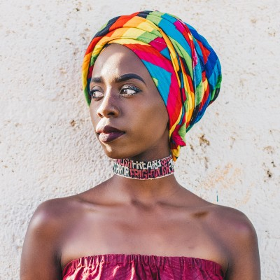
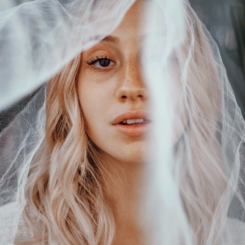
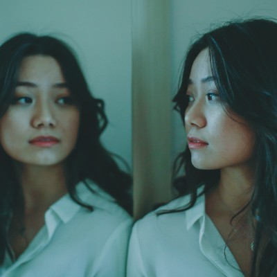
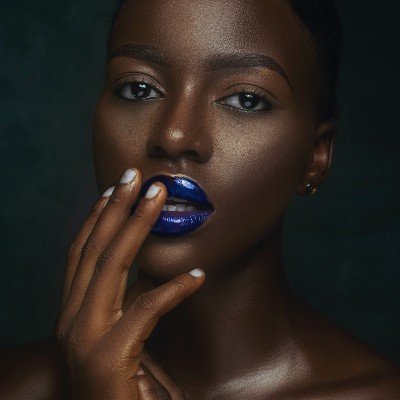

# Dia 20 - Album de Fotos usando Flex e Hover


-   [Codepen](https://codepen.io/lizvidotti91/pen/yLOwaqe);

## Tecnologias Usadas

-   HTML
-   CSS

## O que eu aprendi

-   [CSS FlexBox](https://www.w3schools.com/css/css3_flexbox.asp);
-   [CSS Filter Property](https://www.w3schools.com/cssref/css3_pr_filter.asp);
-   [CSS Position](https://www.w3schools.com/css/css_positioning.asp);
-   [CSS :hover](https://www.w3schools.com/cssref/sel_hover.asp);

## Passo a passo

Para este desafio, usei como referência o Codepen da [Cynthia Costa](https://codepen.io/cycosta/pen/wvMeNoJ?editors=1100).

A base do nosso arquivo HTML será a seguinte:

```html
<div class="album">
    <div class="column">
        <a
            href="https://www.pexels.com/pt-br/foto/bebida-cafe-caneca-copo-2049905/"
            target="blank"
        >
            <figure>
                
            </figure>
            <figcaption>Photo by &copy; Leonne Brito</figcaption>
        </a>

        <a
            href="https://www.pexels.com/pt-br/foto/afro-vestuario-vestimenta-indumentaria-4394790/"
            target="blank"
        >
            <figure>
                
            </figure>
            <figcaption>Photo by &copy; Gabriel Pompeo</figcaption>
        </a>

        <a
            href="https://www.pexels.com/pt-br/foto/acessorio-vestimenta-indumentaria-blusa-4615699/"
            target="blank"
        >
            <figure>
                
            </figure>
            <figcaption>Photo by &copy; Breston Kenya</figcaption>
        </a>

        <a
            href="https://www.pexels.com/pt-br/foto/sozinho-solitario-cabelo-preto-cabelo-escuro-4635389/"
            target="blank"
        >
            <figure>
                
            </figure>
            <figcaption>Photo by &copy; Camila Cordeiro</figcaption>
        </a>
    </div>

    <div class="column">
        <a
            href="https://www.pexels.com/pt-br/foto/orgulho-gay-orgulho-lgbt-descalco-pe-descalco-4557822/"
            target="blank"
        >
            <figure>
                
            </figure>
            <figcaption>Photo by &copy; Anna Shvets</figcaption>
        </a>

        <a
            href="https://www.pexels.com/pt-br/foto/casa-de-campo-adulto-afeicao-carinho-5085245/"
            target="blank"
        >
            <figure>
                
            </figure>
            <figcaption>Photo by &copy; Yaroslav Shuraev</figcaption>
        </a>

        <a
            href="https://www.pexels.com/pt-br/foto/fofo-bonitinho-elegante-sofisticado-5373737/"
            target="blank"
        >
            <figure>
                
            </figure>
            <figcaption>Photo by &copy; Francesca Zama</figcaption>
        </a>

        <a
            href="https://www.pexels.com/pt-br/foto/adulto-afro-lindo-bonito-5380749/"
            target="blank"
        >
            <figure>
                
            </figure>
            <figcaption>Photo by &copy; Tubarones</figcaption>
        </a>
    </div>

    <div class="column">
        <a
            href="https://www.pexels.com/pt-br/foto/adulto-poltrona-despreocupado-animado-4422971/"
            target="blank"
        >
            <figure>
                
            </figure>
            <figcaption>Photo by &copy; Maskin Goncharenok</figcaption>
        </a>

        <a
            href="https://www.pexels.com/pt-br/foto/apartamento-encantador-cativante-lindo-4333559/"
            target="blank"
        >
            <figure>
                
            </figure>
            <figcaption>Photo by &copy; Jessica Ticozzelli</figcaption>
        </a>

        <a
            href="https://www.pexels.com/pt-br/foto/adulto-morena-cafe-concentracao-5208023/"
            target="blank"
        >
            <figure>
                
            </figure>
            <figcaption>Photo by &copy; Wictor Cardoso</figcaption>
        </a>

        <a
            href="https://www.pexels.com/pt-br/foto/adulto-bokeh-fora-de-foco-cidade-5203869/"
            target="blank"
        >
            <figure>
                
            </figure>
            <figcaption>Photo by &copy; Darwis Alwan</figcaption>
        </a>
    </div>

    <div class="column">
        <a
            href="https://www.pexels.com/pt-br/foto/pessoa-mulher-computador-portatil-laptop-3846135/"
            target=""
        >
            <figure>
                
            </figure>
            <figcaption>Photo by &copy; Anna Shvets</figcaption>
        </a>

        <a
            href="https://www.pexels.com/pt-br/foto/afro-lindo-bonito-atraente-4227203/"
            target="blank"
        >
            <figure>
                
            </figure>
            <figcaption>Photo by &copy; Jackson David</figcaption>
        </a>

        <a
            href="https://www.pexels.com/pt-br/foto/beleza-encanto-modelo-mulher-36469/"
            target="blank"
        >
            <figure>
                
            </figure>
            <figcaption>Photo by &copy; Pixabay</figcaption>
        </a>

        <a
            href="https://www.pexels.com/pt-br/foto/mulher-afro-americana-lindo-bonito-atraente-3951477/"
            target="blank"
        >
            <figure>
                
            </figure>
            <figcaption>Photo by &copy; 4TH FingerStudio</figcaption>
        </a>
    </div>
</div>
```

Temos uma `<div class="album"></div>` principal, que guarda quatro `<div class="column"></div>`, as quais funcionam como quatro colunas de imagens, resultando num quadro de 16 imagens. As imagens estão num link `<a></a>`, as quais guardam a imagem e sua legenda. Ao clicar numa imagem, abre-se uma nova aba do navegador, com o site onde a imagem está hospedada.

Todas as imagens são do site [Pexels](https://www.pexels.com/pt-br/), e são gratuitas.

No arquivo CSS, vamos aplicar algumas estilizações em todo o documento. Para isso, usaremos o `*`:

```css
* {
    box-sizing: border-box;
    margin: 0;
    padding: 0;
    text-decoration: none;
}
```

Aqui, o tamanho das nossas caixas serão medidos a partir das bordas (por padrão, as caixas são medidas a partir de seu conteúdo. Por exemplo, quando aplico um `padding:`, o tamanho final da caixa será alterado devido ao tamanho do `padding:`. Quando são medidas a partir das bordas, todo o conteúdo se ajusta ao valor definido para largura e altura); terão `margin:` e `padding:` com valor zero; e todos os textos colocados no documento não serão sublinhados.

Para centralizar o conteúdo na tela, usaremos as três propriedades juntas `align-items: center; display: flex; justify-content: center;`. Dessa forma, o conteúdo é centralizado nos sentidos horizontal e vertical; vamos completar definindo a altura do corpo `height: 100vh;`, para que o conteúdo centralize no sentido vertical. Agora, cabeçalho, conteúdo e rodapé estarão ocupando a mesma linha; vamos usar `flex-direction: column;` para que o conteúdo volte a ficar em colunas. Apliquei uma cor de fundo `background-color:` e defini a largura do corpo em 100vw. Observe que as unidades de medida de altura e largura, respectivamente 100vh (Viewport Height) e 100vw (Viewport Width), são medidas que se relacionam com o tamanho da tela. O valor 100 quer dizer que ele tem exatamente o tamanho da tela.

```css
body {
    align-items: center;
    background-color: #05204a;
    display: flex;
    flex-direction: column;
    height: 100vh;
    justify-content: center;
    width: 100vw;
}
```

Agora, vamos estilizar a `<div class="album"></div>`. Vamos usar `display:flex;` para que as colunas fiquem lado a lado, e o tamanho da caixa `height: 37vw; width: 37vw`, deixando nosso álbum quadrado.

```css
div.album {
    display: flex;
    height: 37vw;
    width: 37vw;
}
```

Estilizando as colunas:

```css
div.album div.column {
    display: flex;
    flex-direction: column;
    height: 100%;
    width: 25%;
}
```

Para deixar as imagens dispostas em colunas, usaremos o `display: flex; flex-direction: column;`. Vamos definir o tamanho das colunas: ela terá altura igual à altura de `<div class="album"></div>`, então usaremos `height: 100%;`. Como as quatro colunas são filhas da nossa caixa album, o valor de 100% é relativo ao tamanho do elemento-principal, ou elemento-pai. Para a largura, vamos deixar em `width: 25%;`, ou seja, 25% do tamanho da largura do elemento-pai.

Agora, vamos estilizar o elemento `<a></a>`, que guarda a imagem e sua legenda. Vamos usar `cursor: pointer;` para que, ao passar o mouse sobre a foto, o ícone do mouse mude da setinha para a mãozinha. A altura da caixa terá 25% em relação ao seu elemento-pai (que, no caso, é a `<div class="column"></div>`). Sua posição será relativa, e vamos modificar seu tamanho usando `transform: scale(0.95)`, criando um espaçamento entre as imagens. Dentro dos parênteses, os valores menores que 1 causam uma diminuição do tamanho original, e valores maiores que 1, aumentam a imagem em relação ao seu tamanho original.

```css
div.album div.column a {
    cursor: pointer;
    height: 25%;
    position: relative;
    transform: scale(0.95);
}
```

Nossa imagem se encontra dentro de uma tag `<figure></figure>`. Vamos definir um tamanho para ela, que será igual ao tamanho do elemento-pai (no caso, o link `<a></a>`).

```css
div.album div.column a figure {
    height: 100%;
}
```

Agora, vamos ajustar o tamanho da imagem, que terá o mesmo tamanho do elemento-pai (que no caso, é a tag `<figure></figure>`). Também aplicaremos o `transition: 0.5s`, pois aplicaremos um `:hover` para a imagem, ou seja, teremos algumas estilizações ao passar o mouse sobre a imagem. A transição deixa a animação mais suave.

```css
div.album div.column a figure img {
    height: 100%;
    transition: 0.5s;
}
```

Primeiro, ao passar a imagem sobre uma foto, quero que todas as imagens do álbum fiquem preto-e-branco. Para isso, vamos aplicar o `:hover` sobre a `<div class="album"></div>`. Como todas as imagens estão dentro deste elemento, vai parecer que estamos passando o mouse diretamente sobre a imagem. Para isso, ao invés de chamar a imagem pela tag `img`, estarei me referindo a ela pelo nome de sua classe `.image`.

```css
.album:hover .image {
    filter: grayscale(1);
    transform: scale(0.98);
}
```

Repare que todas as imagens possuem duas classes: `.album` e `.image`. Agora, para que apenas a imagem onde o mouse passar por cima fique colorida, aplicaremos o `:hover` na tag `a`. Ao invés de chamar a imagem pela tag `img`, estarei me referindo a ela pelos dois nomes de sua classe: `.album.image`.

```css
a:hover .album.image {
    filter: grayscale(0);
    transform: scale(1.05);
}
```

Agora, ao passar o mouse sobre a foto, todas as imagens ficarão preto-e-branco e diminuíram ligeiramente de tamanho, enquanto a foto onde estiver o mouse ficará colorida e ligeiramente maior.

Agora, vamos estilizar a legenda de cada foto. Ela terá posição absoluta em relação ao elemento-pai (no caso, a tag `<a></a>`), ficando "por cima" da foto. Basta fixar os valores de `top:` e `left:`, para que a legenda fique junto à margem inferior da foto. Deixaremos a opacidade com valor zero, para que o texto fique transparente, e só apareça quando passarmos o mouse sobre a foto. Aplicamos também uma transição, para tornar essa animação mais fluida.

```css
div.album div.column a figcaption {
    background-color: #e1e2ef8f;
    color: #02020a;
    left: 0;
    opacity: 0;
    position: absolute;
    top: 70%;
    text-align: center;
    transition: 0.5s;
    width: 100%;
}
```

Agora, aplicamos o `:hover` na tag `a` e estilizar nossa legenda. Apenas alteramos a opacidade para 1, onde o elemento ficará visível na tela novamente. O valor de opacidade varia de 0 a 1, onde 0 é totalmente transparente, e 1, totalmente opaco.

```css
div.album div.column a:hover figcaption {
    opacity: 1;
}
```
